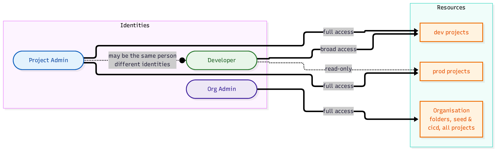
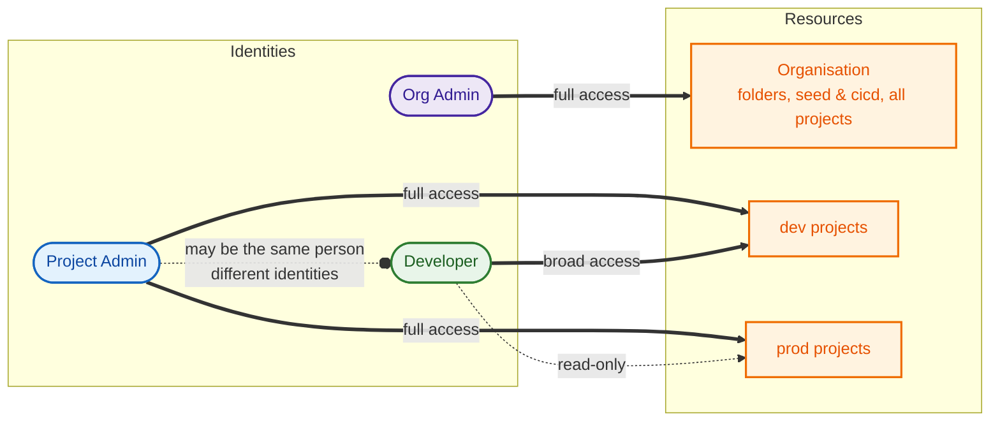

# Access Pattern

A three-tier access model:

- **Org Admin** — full access to everything at the organisation level (all folders and projects, including `seed` and `cicd`).
- **Project Admin** — full access across all service projects in every environment.
- **Developer** — broad access to `dev` projects, read-only to `prod` projects (thick edge = broad/full access, dotted edge = read-only).

Developers and Project Admins may be the same people, but operate under different identities depending on the level of access required.
