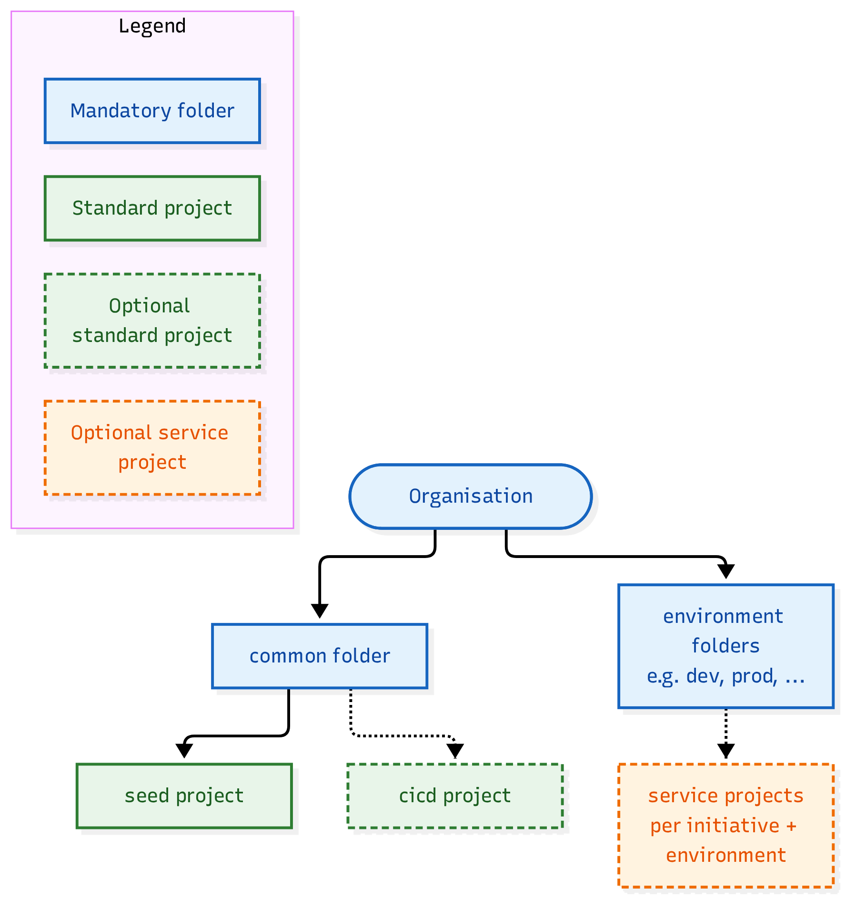
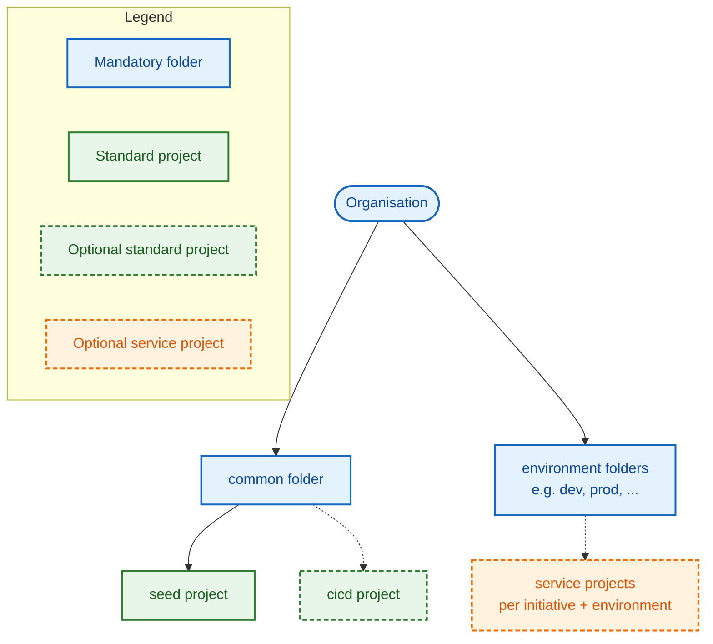

# Folder / Project Topology

Solid borders are mandatory; dashed borders are optional and enabled per your organisation's needs. **Standard projects** (green — `seed`, `cicd`) are created via the `project` module and live under the `common` folder. **Service projects** (orange) are created by the project-factory via the `service-project` module and live under environment folders, one per initiative + environment.
